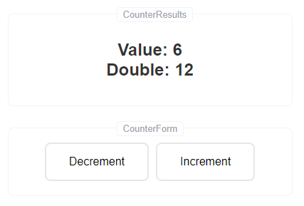

<p align="center">


</p>

<p align="center">
    <h1 align="center">MobX и React Context AP</h1>
  </a>
</p>


см. [MobX-Cookbook: React Context API](https://mobx-cookbook.github.io/react-integration/context-api)





## Installation

```shell
git clone https://github.com/shopot/mobx-context-example.git

cd mobx-context-example

npm install
```

## Running the app

```shell
# development
$ npm run dev

# build production
$ npm run build

# preview the production build
$ npm run preview

# start linting
$ npm run lint
```
